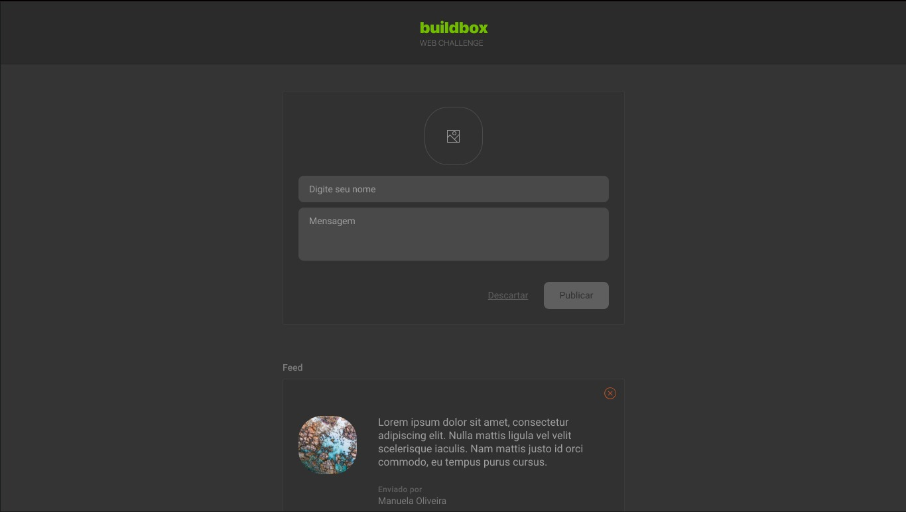

<h1 align="center"> Buildbox - Post </h1>

Desafio Buildbox

  <a href="#-tecnologias">Tecnologias</a>&nbsp;&nbsp;&nbsp;|&nbsp;&nbsp;&nbsp;
  <a href="#-projeto">Projeto</a>&nbsp;&nbsp;&nbsp;|&nbsp;&nbsp;&nbsp;
  <a href="#-layout">Layout</a>&nbsp;&nbsp;&nbsp;|&nbsp;&nbsp;&nbsp;
  <a href="#memo-licença">Licença</a>

  

 

  

## 🚀 Tecnologias

Esse projeto foi desenvolvido com as seguintes tecnologias:

- JavaScript/Typescript
- [Node](https://nodejs.org/)
- [React Hook Form](https://react-hook-form.com/)
- [ReactJS](https://reactjs.org/)
- [Styled Components](https://styled-components.com/)
- [Vite](https://vitejs.dev/)
- [Yarn](https://yarnpkg.com/)
- [Zod](https://zod.dev/)

## 💻 Projeto

O BuildBox é uma aplicação de publicação de Postagens, que contém as seguintes
funcionalidades:

- Upload de imagem em uma nova postagem
- Remover imagem de uma nova postagem
- Adicionar uma nova postagem
- Cada postagem contém uma mensagem, nome e imagem do autor
- Remover uma postagem da listagem
- Armazenar as postagens em LocalStorage

Apesar de serem poucas funcionalidades, os seguintes conceitos foram abordados
para a implementação:

- Componentização
- Context API
- Estados
- Estilização e Responsividade
- Imutabilidade do estado
- Listas e chaves no ReactJS
- Propriedades
- Validação de formulário com Zod

## 🔖 Layout

Você pode visualizar o layout do projeto através
[DESSE LINK](https://github.com/Buildbox-ItSolutions/web-developer-challenge).

## :memo: Licença

Esse projeto está sob a licença MIT.

---

Feito com ♥ by [@indio.code](https://instagram.com/indio.code) :wave:
